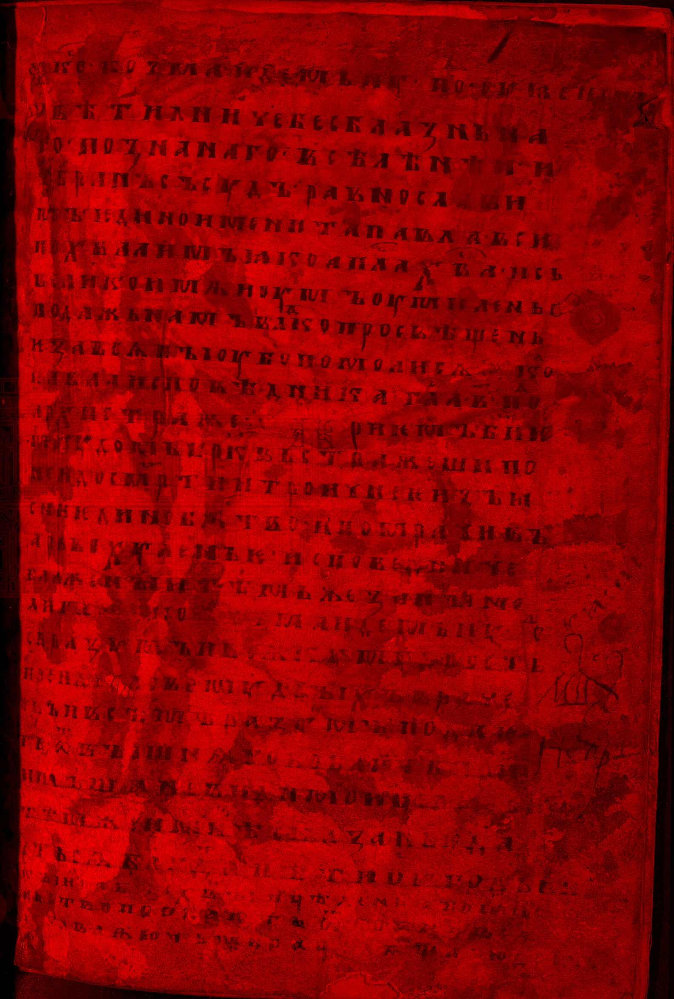
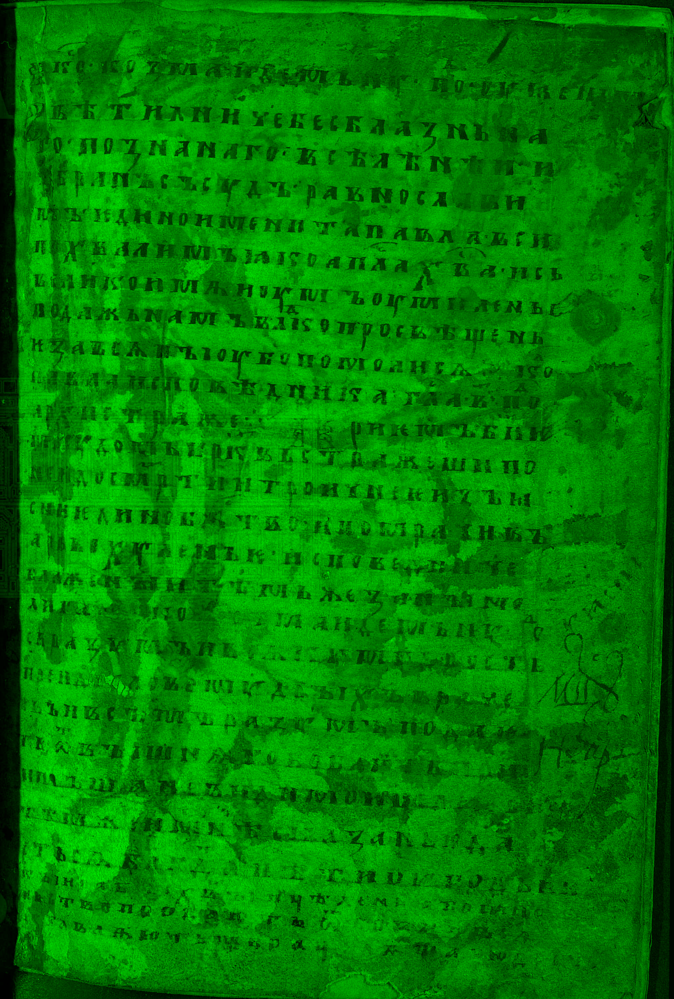
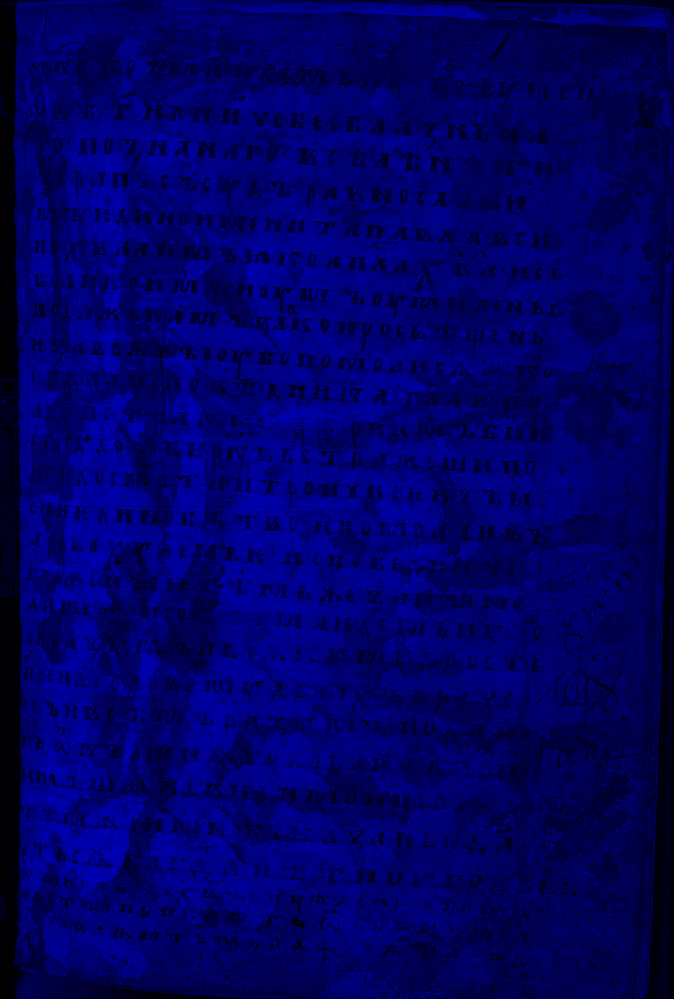
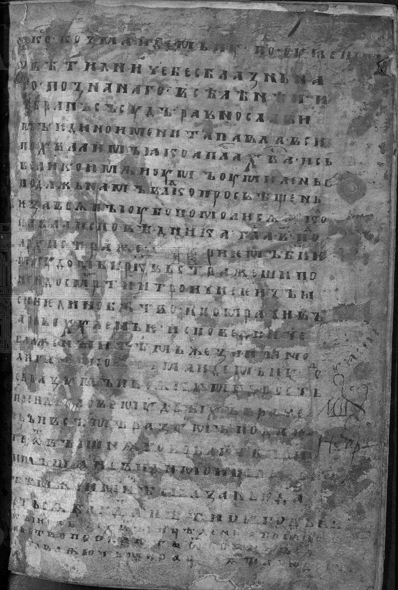
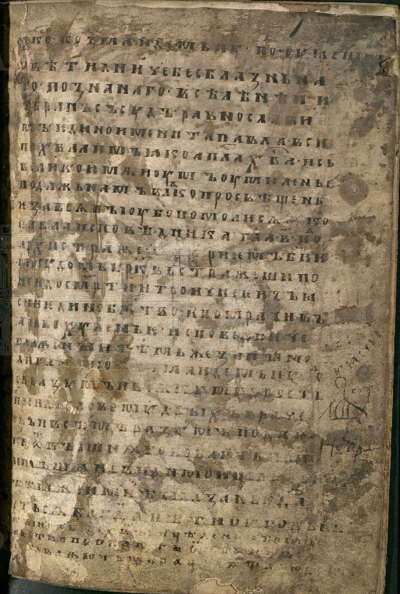

# Лабораторная работа №1. Цветовые модели и передискретизация изображений

## Исходное изображение

В качестве исходного изображения использована страница рукописи из выборки **«Жесть»**.

**Файл исходного изображения:** `pictures_src/zhest.png`

# Часть 1. Цветовые модели

В первой части лабораторной работы были выполнены следующие операции:

1. Выделены цветовые компоненты **R**, **G**, **B** и сохранены как отдельные изображения.
2. Исходное изображение переведено в цветовую модель **HSI**.
3. Из модели **HSI** сохранена яркостная компонента **I**.
4. Выполнена инверсия яркостной компоненты **I** с последующим преобразованием обратно в RGB.

## Задание 1. Выделение компонент R, G, B

### Компонента R
**Файл результата:** `pictures_results_1/zhest_r.png`

Компонента R:

**Что было сделано:**  
Из исходного изображения был оставлен только красный канал, а зелёный и синий занулены.

**Что получилось:**  
Изображение представлено в красно-чёрных оттенках. Светлые участки бумаги хорошо видны, текст остаётся заметным, но отображается только через вклад красного канала.

**Краткий вывод:**  
Красная компонента показывает вклад красного цвета в изображение и позволяет отдельно оценить, как фон и текст распределены по этому каналу.

### Компонента G
**Файл результата:** `pictures_results_1/zhest_g.png`

**Что было сделано:**  
Из изображения был сохранён только зелёный канал, остальные каналы обнулены.

**Что получилось:**  
Изображение отображается в зелёно-чёрных оттенках. Бумажный фон и потёртости также хорошо различимы.

**Краткий вывод:**  
Зелёная компонента позволяет увидеть распределение яркости по зелёному каналу и сравнить его с красной и синей составляющими.

### Компонента B
**Файл результата:** `pictures_results_1/zhest_b.png`

**Что было сделано:**  
Из исходного изображения оставлен только синий канал.

**Что получилось:**  
Изображение стало заметно темнее по сравнению с каналами R и G, так как в цвете старой бумаги и коричневых участках вклад синего обычно меньше.

**Краткий вывод:**  
Синяя компонента показывает меньшую выраженность фона и помогает увидеть различия между цветовыми каналами изображения.

## Задание 2. Получение яркостной компоненты в модели HSI

**Файл результата:** `pictures_results_1/zhest_intensity.png`

**Что было сделано:**  
Исходное изображение было преобразовано из RGB в HSI, после чего отдельно сохранена яркостная компонента **I**.

**Что получилось:**  
Получено полутоновое изображение, на котором отражена только яркость без учёта цветового оттенка. Буквы, пятна, повреждения бумаги и фон страницы видны в градациях серого.

**Краткий вывод:**  
Яркостная компонента позволяет анализировать структуру изображения без влияния цвета и показывает распределение светлых и тёмных участков.

## Задание 3. Инверсия яркостной компоненты

**Файл результата:** `pictures_results_1/zhest_hsi_inverted.png`

**Что было сделано:**  
После перехода к HSI яркостная компонента **I** была инвертирована, затем изображение преобразовано обратно в RGB.

**Что получилось:**  
Светлые области бумаги стали темнее, а тёмные участки текста и повреждений — светлее. При этом цветовая структура изображения в целом сохранилась.

**Краткий вывод:**  
Инверсия яркости позволяет изменить визуальное распределение светлых и тёмных зон изображения без прямого инвертирования всех RGB-значений.

## Общий вывод по части 1

В первой части лабораторной работы было показано, что одно и то же изображение можно представить через отдельные цветовые каналы и через яркостную компоненту. Разложение на R, G, B позволяет анализировать вклад каждого канала, а переход к HSI и выделение компоненты I — исследовать яркость независимо от цвета. Инверсия яркостной компоненты демонстрирует, как изменяется визуальное восприятие изображения при изменении только светлоты.

# Часть 2. Передискретизация изображения

Во второй части лабораторной работы были выполнены следующие операции:

1. Интерполяция изображения в **M = 2** раза.
2. Децимация изображения в **N = 3** раза.
3. Передискретизация изображения с коэффициентом **K = M / N = 2 / 3** в два прохода.
4. Передискретизация изображения с коэффициентом **K = 2 / 3** за один проход.

## Задание 1. Растяжение изображения в M раз (M = 2)

**Файл результата:** `pictures_results_2/zhest_interp.png`

**Что было сделано:**  
Изображение было увеличено в 2 раза по ширине и высоте методом передискретизации без использования библиотечных функций `resize()`.

**Что получилось:**  
Размер изображения увеличился в 2 раза по каждой координате. Новых деталей не появилось, но изображение стало более крупным. При увеличении масштаба просмотра заметна пикселизация.

**Краткий вывод:**  
Интерполяция увеличивает размер изображения, но не восстанавливает новые детали. При простом методе выбора ближайшего пикселя заметна ступенчатость.

## Задание 2. Сжатие изображения в N раз (N = 3)

**Файл результата:** `pictures_results_2/zhest_dec.png`

**Что было сделано:**  
Изображение было уменьшено в 3 раза по ширине и высоте.

**Что получилось:**  
Изображение стало значительно меньше. Мелкие детали, тонкие штрихи букв и небольшие дефекты бумаги стали менее различимыми.

**Краткий вывод:**  
При децимации часть визуальной информации теряется, особенно на участках с мелкими элементами и тонкими линиями.

## Задание 3. Передискретизация в K = M/N раз через растяжение и последующее сжатие

При выполнении задания использовались:
- **M = 2**
- **N = 3**
- **K = 2 / 3**

**Файл результата:** `pictures_results_2/zhest_two_pass.png`

**Что было сделано:**  
Сначала изображение было увеличено в 2 раза, затем полученный результат был уменьшен в 3 раза.

**Что получилось:**  
Итоговый размер изображения стал равен примерно 2/3 от исходного. При этом из-за двух последовательных преобразований часть искажений и артефактов выражена сильнее, чем при прямом преобразовании.

**Краткий вывод:**  
Двухпроходная передискретизация демонстрирует влияние последовательного изменения масштаба и может давать больше искажений по сравнению с однопроходным методом.

## Задание 4. Передискретизация в K раз за один проход

Использовался коэффициент:
- **K = 2 / 3 ≈ 0.6667**

**Файл результата:** `pictures_results_2/zhest_one_pass.png`

**Что было сделано:**  
Изображение было приведено к масштабу 2/3 от исходного сразу за один проход.

**Что получилось:**  
Получено изображение того же итогового масштаба, что и в предыдущем задании, но без промежуточного этапа увеличения. Визуально результат выглядит более аккуратным.

**Краткий вывод:**  
Однопроходная передискретизация позволяет получить итоговое изображение нужного масштаба с меньшим числом промежуточных искажений.

## Общий вывод по части 2

Во второй части лабораторной работы были исследованы основные операции передискретизации изображения. При интерполяции размер изображения увеличивается, но без появления новых деталей. При децимации уменьшается объём изображения, однако часть мелких деталей теряется. Двухпроходная и однопроходная передискретизация при одинаковом коэффициенте дают схожий масштаб результата, но однопроходный вариант обычно вносит меньше дополнительных искажений.

# Итоговый вывод по лабораторной работе

В ходе лабораторной работы были изучены две важные группы операций цифровой обработки изображений: работа с цветовыми моделями и изменение пространственного разрешения изображения. На примере страницы рукописи из выборки «Жесть» были получены отдельные цветовые каналы, яркостная компонента в модели HSI, а также результат инверсии яркости. Кроме того, были реализованы интерполяция, децимация, двухпроходная и однопроходная передискретизация. Полученные результаты показывают, как изменение цветового представления и масштаба влияет на визуальное восприятие и качество изображения.