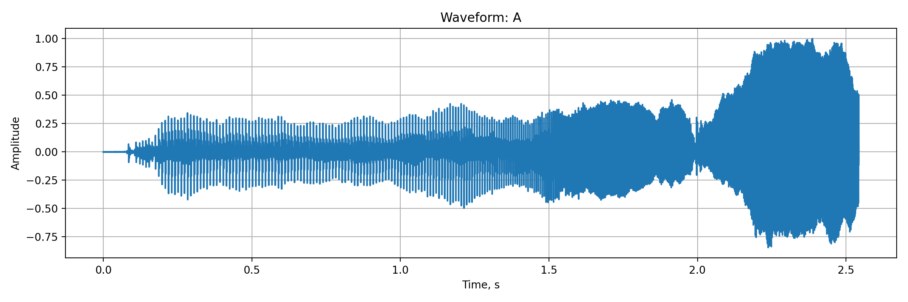
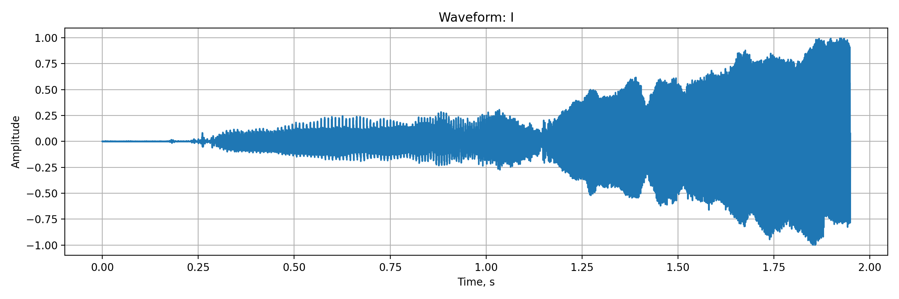
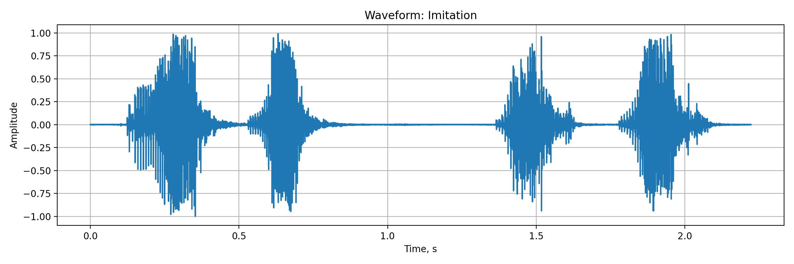
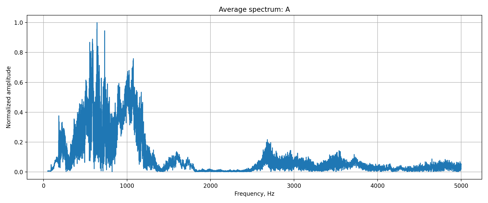
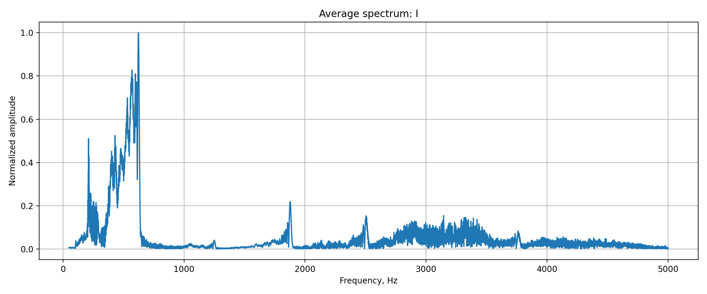
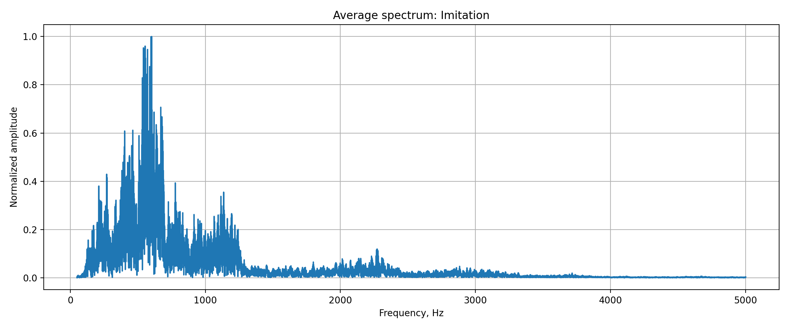
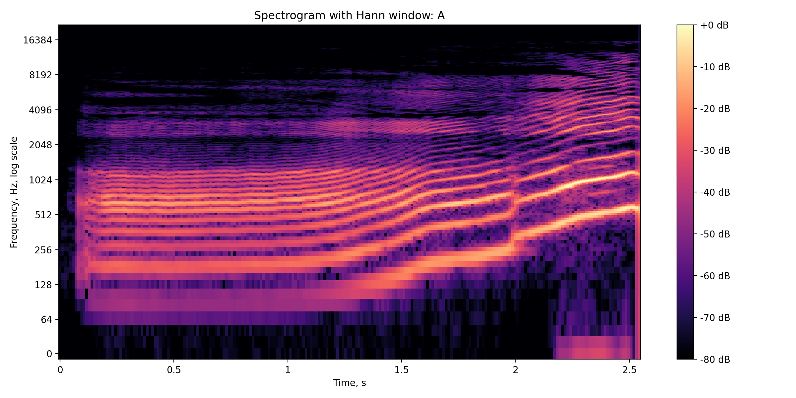
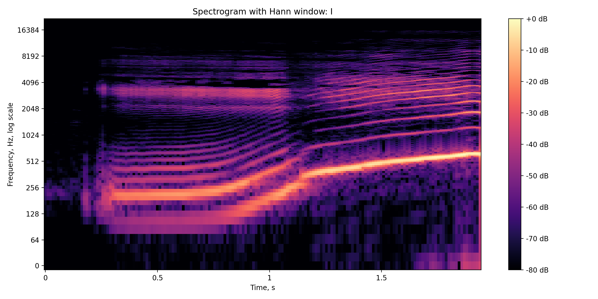
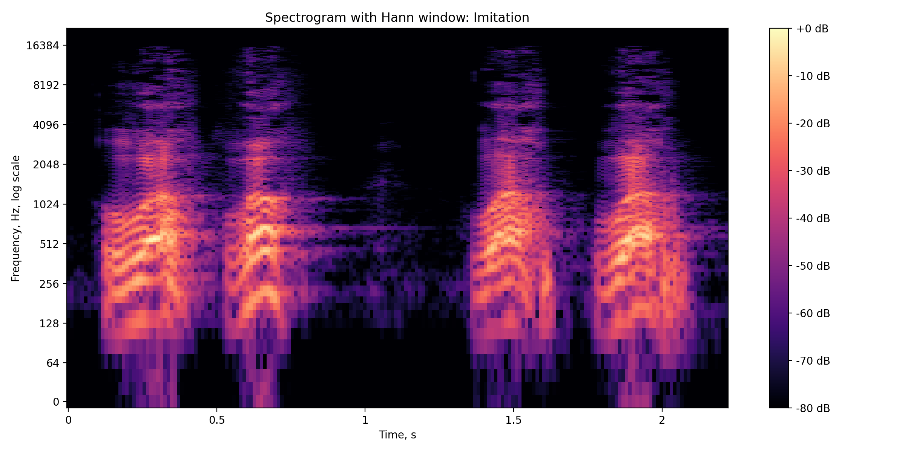

# Лабораторная работа №10. Обработка голоса

**Вариант:** `1`
**Тема:** `Голосовой диапазон, тембр, форманты`
**Метод:** `оконное преобразование Фурье с окном Ханна`
**Формат аудио:** `.wav`, mono, 44100 Hz

---

## Теоретическая часть

В работе рассматривается спектральный анализ голосовых сигналов.

**Звук** — это механические колебания, которые в цифровом виде представлены последовательностью отсчётов амплитуды во времени.

Для анализа голоса используются следующие понятия:

* **амплитуда** — величина колебаний звукового сигнала;
* **частота** — количество колебаний в секунду, измеряется в Гц;
* **основной тон** — базовая частота голосового сигнала;
* **обертоны** — частоты, кратные основному тону;
* **тембр** — окраска звука, зависящая от распределения энергии по частотам;
* **форманты** — частотные области, где энергия речевого сигнала максимальна.

Для визуализации частотного состава используется **спектрограмма**.
Она показывает изменение спектра во времени: по оси X откладывается время, по оси Y — частота, а цвет показывает энергию частотной компоненты.

В лабораторной работе спектрограммы строятся с помощью **STFT** — оконного преобразования Фурье.
Используется **окно Ханна**, а частоты отображаются в логарифмической шкале, так как это удобнее для анализа голосового диапазона.

---

## Практическая часть

Были записаны три звуковые дорожки:

* [`input/a_voice.wav`](input/a_voice.wav) — протяжный звук «А»;
* [`input/i_voice.wav`](input/i_voice.wav) — протяжный звук «И»;
* [`input/imitation.wav`](input/imitation.wav) — имитационный голосовой звук.

Все записи сохранены в формате `.wav`, имеют один канал и частоту дискретизации 44100 Гц.

---

## Что реализуется в файлах

[`src/main.py`](src/main.py) — основной файл программы.

[`input/`](input/) — папка с исходными аудиофайлами:

* [`input/a_voice.wav`](input/a_voice.wav) — запись звука «А»;
* [`input/i_voice.wav`](input/i_voice.wav) — запись звука «И»;
* [`input/imitation.wav`](input/imitation.wav) — имитационный звук.

[`output/`](output/) — папка со всеми результатами обработки.

[`output/spectra/`](output/spectra/) — осциллограммы и средние спектры:

* [`output/spectra/A_waveform.png`](output/spectra/A_waveform.png)
* [`output/spectra/A_spectrum.png`](output/spectra/A_spectrum.png)
* [`output/spectra/I_waveform.png`](output/spectra/I_waveform.png)
* [`output/spectra/I_spectrum.png`](output/spectra/I_spectrum.png)
* [`output/spectra/Imitation_waveform.png`](output/spectra/Imitation_waveform.png)
* [`output/spectra/Imitation_spectrum.png`](output/spectra/Imitation_spectrum.png)

[`output/spectrograms/`](output/spectrograms/) — спектрограммы:

* [`output/spectrograms/A_spectrogram.png`](output/spectrograms/A_spectrogram.png)
* [`output/spectrograms/I_spectrogram.png`](output/spectrograms/I_spectrogram.png)
* [`output/spectrograms/Imitation_spectrogram.png`](output/spectrograms/Imitation_spectrogram.png)

[`output/tables/`](output/tables/) — таблица результатов:

* [`output/tables/voice_analysis_results.csv`](output/tables/voice_analysis_results.csv)

---

## Структура проекта

| Путь                                           | Назначение                   |
| ---------------------------------------------- | ---------------------------- |
| [`input/`](input/)                             | исходные аудиофайлы          |
| [`input/a_voice.wav`](input/a_voice.wav)       | звук «А»                     |
| [`input/i_voice.wav`](input/i_voice.wav)       | звук «И»                     |
| [`input/imitation.wav`](input/imitation.wav)   | имитационный звук            |
| [`output/`](output/)                           | папка с результатами         |
| [`output/spectra/`](output/spectra/)           | waveform и средние спектры   |
| [`output/spectrograms/`](output/spectrograms/) | спектрограммы                |
| [`output/tables/`](output/tables/)             | таблица результатов          |
| [`src/`](src/)                                 | исходный код                 |
| [`src/main.py`](src/main.py)                   | основной скрипт              |
| [`README.md`](README.md)                       | описание лабораторной работы |

---

## Алгоритм обработки

1. Загрузить аудиофайл.
2. Перевести сигнал в mono.
3. Нормализовать амплитуду.
4. Построить осциллограмму.
5. Построить средний спектр.
6. Построить спектрограмму через STFT с окном Ханна.
7. Найти минимальную и максимальную частоту голоса.
8. Найти основной тон.
9. Подсчитать количество обертонов.
10. Найти три наиболее выраженные частотные области.
11. Сохранить результаты в таблицу `.csv`.

---

## Полученные результаты

| Звук     | Файл                                   | Длительность, с | Частота дискретизации, Гц | Мин. частота, Гц | Макс. частота, Гц | Основной тон, Гц | Обертоны | F1, Гц | F2, Гц | F3, Гц |
| -------- | -------------------------------------- | --------------: | ------------------------: | ---------------: | ----------------: | ---------------: | -------: | -----: | -----: | -----: |
| А        | [`a_voice.wav`](input/a_voice.wav)     |           2.543 |                     44100 |           147.84 |           4808.04 |           184.02 |       13 | 587.44 | 641.31 | 732.92 |
| И        | [`i_voice.wav`](input/i_voice.wav)     |           1.949 |                     44100 |           196.00 |           3759.32 |           211.39 |        8 | 571.57 | 598.25 | 623.90 |
| Имитация | [`imitation.wav`](input/imitation.wav) |           2.223 |                     44100 |           124.62 |           2311.04 |           398.14 |        2 | 542.11 | 554.70 | 602.84 |

Полная таблица сохранена в файл:

[`output/tables/voice_analysis_results.csv`](output/tables/voice_analysis_results.csv)

---

## Результаты работы программы

Для каждого аудиофайла были сохранены:

* осциллограмма;
* средний спектр;
* спектрограмма.

---

## Осциллограммы

Папка:

[`output/spectra/`](output/spectra/)

| Звук     | Файл                                                              | Изображение                                                  |
| -------- | ----------------------------------------------------------------- | ------------------------------------------------------------ |
| А        | [`A_waveform.png`](output/spectra/A_waveform.png)                 |                  |
| И        | [`I_waveform.png`](output/spectra/I_waveform.png)                 |                  |
| Имитация | [`Imitation_waveform.png`](output/spectra/Imitation_waveform.png) |  |

---

## Средние спектры

Папка:

[`output/spectra/`](output/spectra/)

| Звук     | Файл                                                              | Изображение                                                  |
| -------- | ----------------------------------------------------------------- | ------------------------------------------------------------ |
| А        | [`A_spectrum.png`](output/spectra/A_spectrum.png)                 |                  |
| И        | [`I_spectrum.png`](output/spectra/I_spectrum.png)                 |                  |
| Имитация | [`Imitation_spectrum.png`](output/spectra/Imitation_spectrum.png) |  |

---

## Спектрограммы

Папка:

[`output/spectrograms/`](output/spectrograms/)

| Звук     | Файл                                                                         | Изображение                                                             |
| -------- | ---------------------------------------------------------------------------- | ----------------------------------------------------------------------- |
| А        | [`A_spectrogram.png`](output/spectrograms/A_spectrogram.png)                 |                  |
| И        | [`I_spectrogram.png`](output/spectrograms/I_spectrogram.png)                 |                  |
| Имитация | [`Imitation_spectrogram.png`](output/spectrograms/Imitation_spectrogram.png) |  |

---

## Сводная таблица файлов результатов

| Тип результата | Звук «А»                                                     | Звук «И»                                                     | Имитация                                                                     |
| -------------- | ------------------------------------------------------------ | ------------------------------------------------------------ | ---------------------------------------------------------------------------- |
| Исходное аудио | [`a_voice.wav`](input/a_voice.wav)                           | [`i_voice.wav`](input/i_voice.wav)                           | [`imitation.wav`](input/imitation.wav)                                       |
| Waveform       | [`A_waveform.png`](output/spectra/A_waveform.png)            | [`I_waveform.png`](output/spectra/I_waveform.png)            | [`Imitation_waveform.png`](output/spectra/Imitation_waveform.png)            |
| Спектр         | [`A_spectrum.png`](output/spectra/A_spectrum.png)            | [`I_spectrum.png`](output/spectra/I_spectrum.png)            | [`Imitation_spectrum.png`](output/spectra/Imitation_spectrum.png)            |
| Спектрограмма  | [`A_spectrogram.png`](output/spectrograms/A_spectrogram.png) | [`I_spectrogram.png`](output/spectrograms/I_spectrogram.png) | [`Imitation_spectrogram.png`](output/spectrograms/Imitation_spectrogram.png) |

---

## Анализ

В лабораторной работе были выполнены все основные пункты задания.

Сначала были записаны три звуковые дорожки: звук «А», звук «И» и имитационный звук. Все файлы имеют формат `.wav`, один канал и частоту дискретизации 44100 Гц, поэтому они подходят для обработки в Python.

Для каждого сигнала была построена спектрограмма с использованием оконного преобразования Фурье и окна Ханна. Частоты были визуализированы в логарифмической шкале, что позволяет лучше рассмотреть низкие и средние частоты голоса.

Минимальная и максимальная частоты были найдены по уровню спектральной энергии. Самый широкий частотный диапазон получился у звука «А»: от 147.84 Гц до 4808.04 Гц. У звука «И» диапазон составил от 196.00 Гц до 3759.32 Гц. У имитационного звука диапазон оказался от 124.62 Гц до 2311.04 Гц.

Основной тон для звука «А» составил 184.02 Гц, для звука «И» — 211.39 Гц, для имитации — 398.14 Гц. Значения для «А» и «И» находятся в обычном голосовом диапазоне, а у имитации основной тон выше, так как звук более резкий и короткий.

Наиболее тембрально окрашенным оказался звук «А», потому что для него прослеживается наибольшее количество обертонов — 13. Для звука «И» найдено 8 обертонов, а для имитации только 2. Это показывает, что звук «А» имеет более богатую гармоническую структуру.

Три наиболее выраженные частотные области были найдены для каждого звука. Для «А» они составили 587.44 Гц, 641.31 Гц и 732.92 Гц. Для «И» — 571.57 Гц, 598.25 Гц и 623.90 Гц. Для имитации — 542.11 Гц, 554.70 Гц и 602.84 Гц.

Форманты в данной работе определяются приближённо как локальные максимумы спектральной энергии. Поэтому найденные значения могут частично соответствовать не настоящим формантам, а сильным гармоникам основного тона. Для более точного формантного анализа требуется использовать анализ спектральной огибающей или LPC-метод.

Несмотря на это, программа позволяет сравнить частотные характеристики разных голосовых сигналов, найти основной тон, оценить диапазон голоса, построить спектрограммы и определить наиболее выраженные частотные области.

---

## Общий вывод

В лабораторной работе был выполнен анализ голосового диапазона, тембра и формант для варианта 1.

Были записаны и обработаны три аудиофайла: звук «А», звук «И» и имитационный звук. Для каждого файла были построены осциллограммы, средние спектры и спектрограммы.

Звук «А» показал самый широкий частотный диапазон и наибольшее количество обертонов, поэтому его можно считать наиболее тембрально насыщенным. Звук «И» имеет немного более высокий основной тон и выраженные высокочастотные составляющие. Имитационный звук отличается короткими фрагментами и меньшим количеством обертонов.

Основные требования лабораторной выполнены: записи подготовлены, спектрограммы построены, минимальные и максимальные частоты найдены, основной тон и обертоны определены, три выраженные частотные области выделены.
