# Лабораторная работа №2. Обесцвечивание и бинаризация растровых изображений. Вариант 14

В лабораторной работе выполнены два этапа обработки изображений:

1. приведение полноцветного изображения к полутоновому;
2. бинаризация полутонового изображения методом адаптивного монохромного преобразования с усреднением по окну.

Исходные изображения использовались в формате PNG.  
Полутоновые и бинарные результаты сохранялись отдельно.

## 1. Приведение изображений к полутону
Полноцветное изображение в модели RGB является трехканальным: каждый пиксель задается тремя компонентами — красной, зеленой и синей. Для дальнейшей бинаризации цветовая информация не требуется, поэтому изображение сначала переводится в полутоновое.

Полутоновое изображение содержит один яркостный канал. Яркость пикселя вычислялась взвешенным усреднением каналов RGB по формуле:

`Y = 0.3R + 0.59G + 0.11B`

Такой переход позволяет сохранить информацию о светлоте, контурах и относительной яркости объектов, отбросив цветовую составляющую.

### Текст
Исходное изображение:  

Полутоновое изображение:  
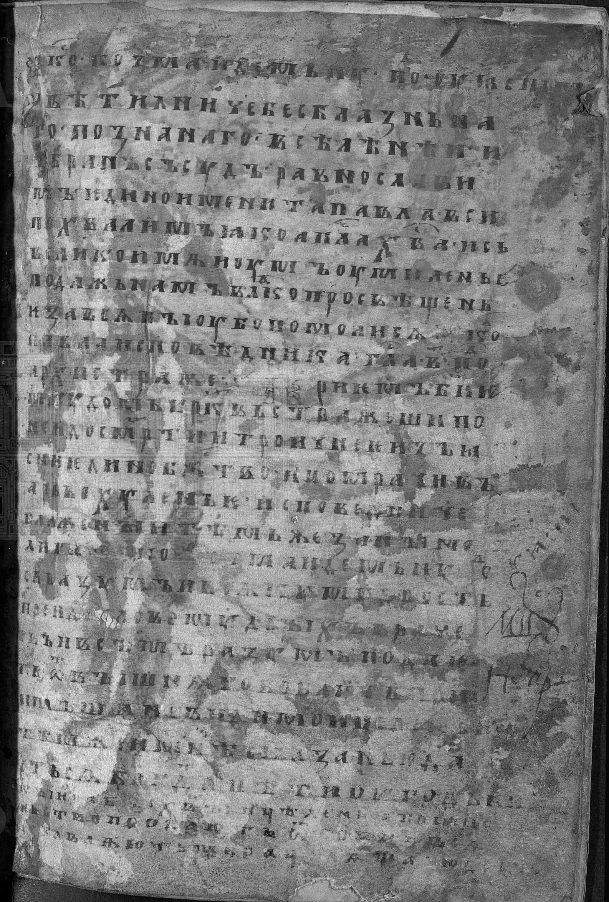

### Мультяшное изображение
Исходное изображение:  
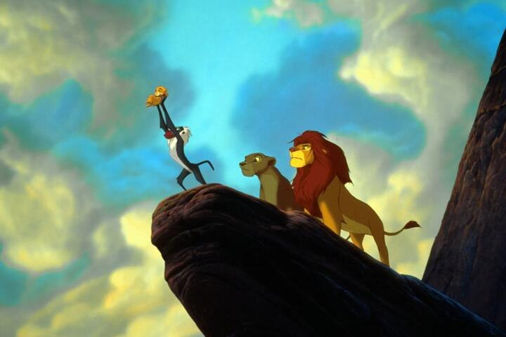

Полутоновое изображение:  
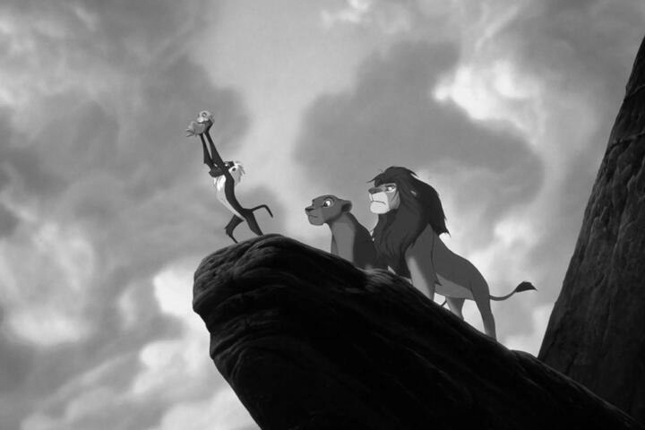

### Фотография
Исходное изображение:  
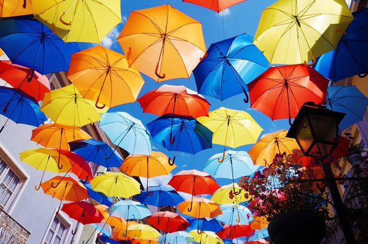

Полутоновое изображение:  
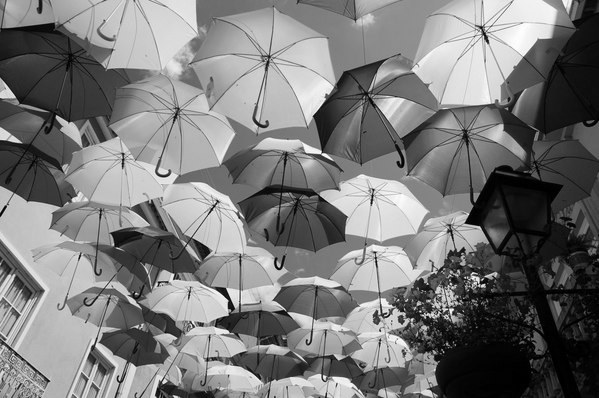

### Рентгеновское изображение
Исходное изображение:  
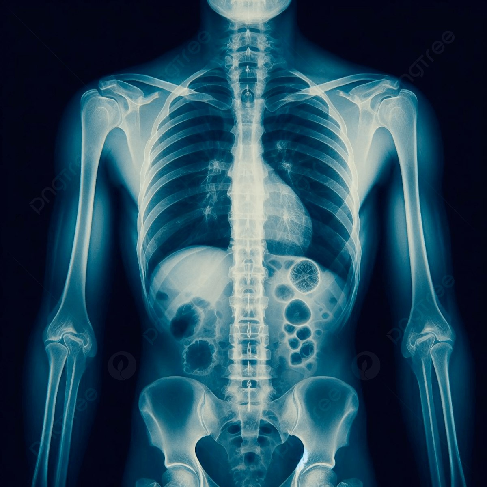

Полутоновое изображение:  
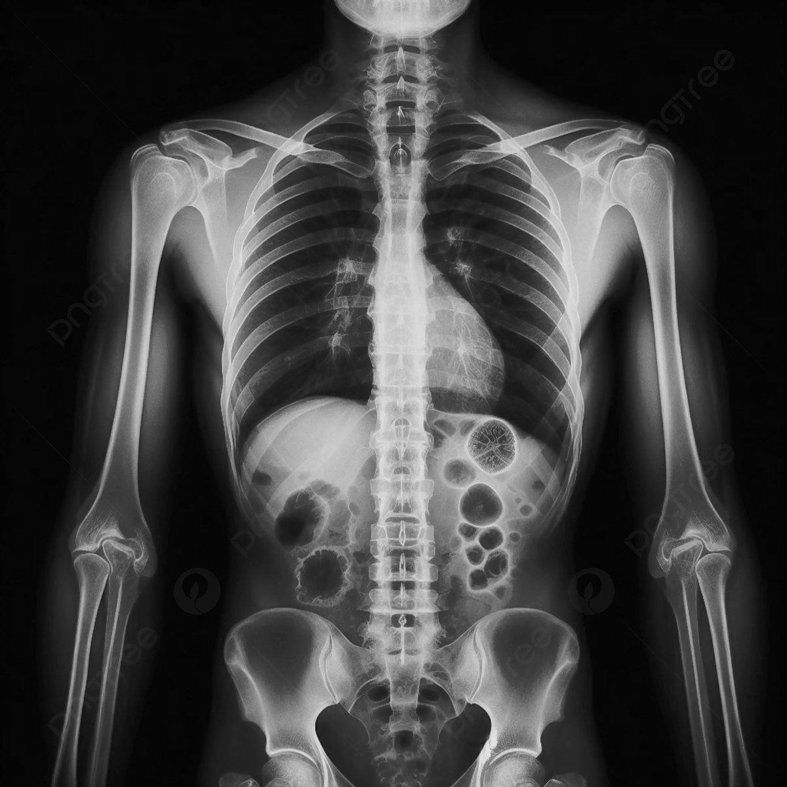

### Карта
Исходное изображение:  
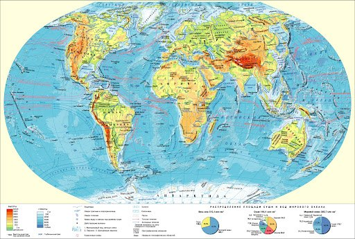

Полутоновое изображение:  
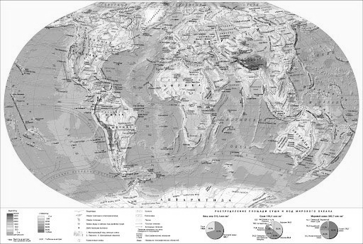

### Вывод по 1 части

Приведение к полутону выполнено корректно для всех изображений. После преобразования исчезает цветовая информация, однако сохраняются основные границы объектов, распределение освещенности и детали по яркости. Полученные полутоновые изображения пригодны для последующей бинаризации.

## 2. Бинаризация изображений

Во второй части работы использовался метод адаптивного монохромного преобразования с усреднением по окну.

В отличие от глобальной бинаризации, где для всего изображения используется один общий порог, в адаптивном методе порог вычисляется отдельно для каждого пикселя с учетом его локальной окрестности. Это особенно важно для изображений с неравномерным освещением, тенями и локальными перепадами яркости.

Для каждого пикселя `I(x, y)` рассматривалось квадратное окно размера `D×D`.  
Внутри этого окна вычислялась средняя яркость:

`Avg(x, y) = (1 / D^2) * Σ I(r, s)`

После этого применялось решающее правило:

- если `I(x, y) >= Avg(x, y)`, то пиксель становился белым;
- иначе пиксель становился черным.

Таким образом, бинаризация выполнялась не по одному постоянному порогу, а по локальному среднему значению.  
В работе использовались два размера окна: `5×5` и `15×15`.

### Текст
Исходное изображение:  

Полутоновое изображение:  

Бинаризация, окно 5×5:  
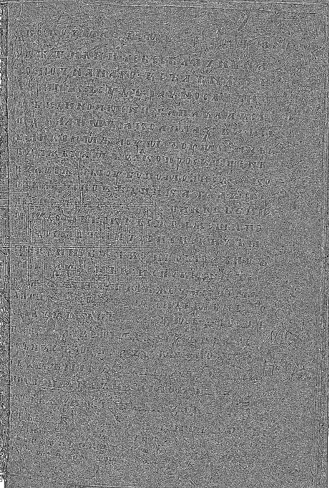

Бинаризация, окно 15×15:  
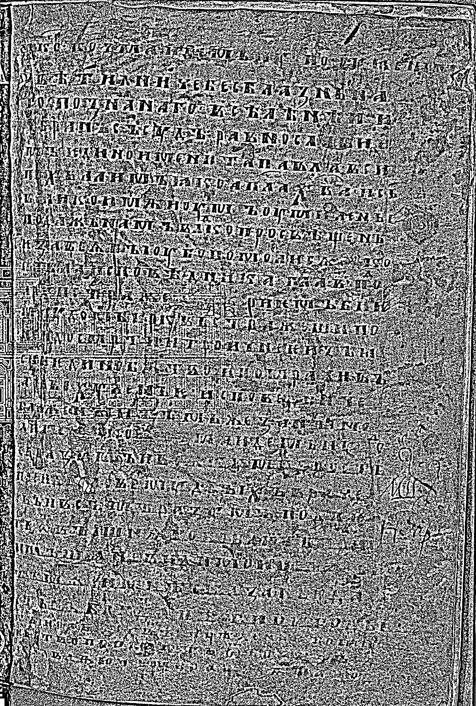

### Мультяшное изображение
Исходное изображение:  

Полутоновое изображение:  

Бинаризация, окно 5×5:  
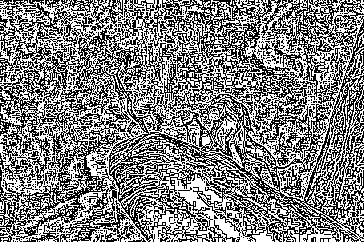

Бинаризация, окно 15×15:  
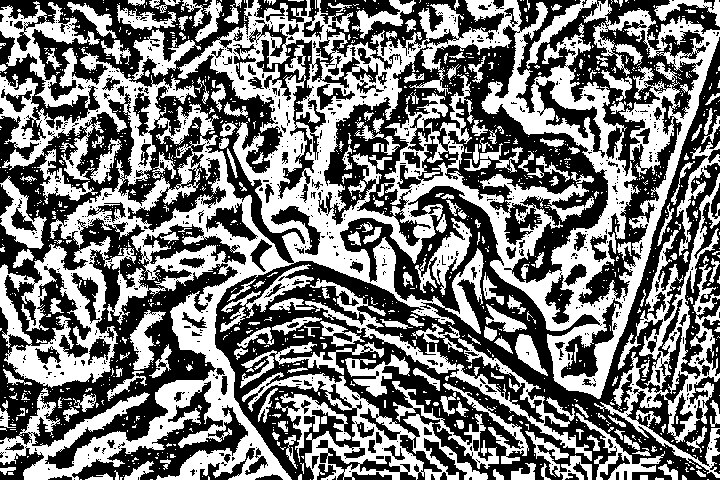

### Фотография
Исходное изображение:  

Полутоновое изображение:  

Бинаризация, окно 5×5:  
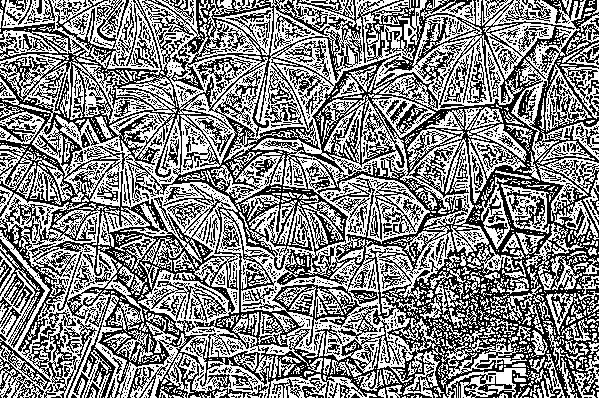

Бинаризация, окно 15×15:  
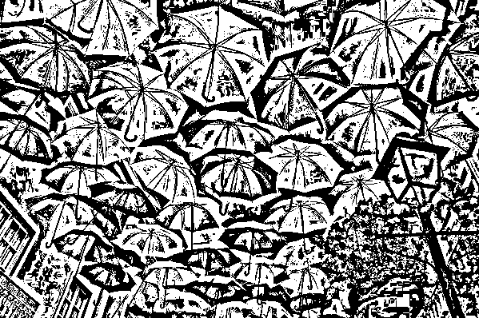

### Карта
Исходное изображение:  

Полутоновое изображение:  

Бинаризация, окно 5×5:  
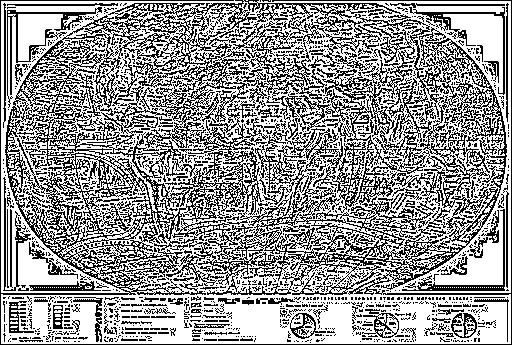

Бинаризация, окно 15×15:  
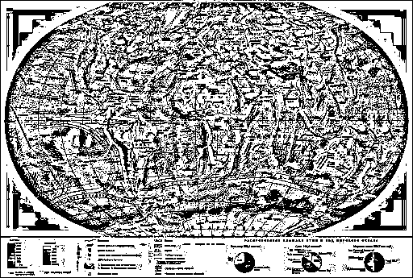

### Вывод по 2 части

Результат бинаризации заметно зависит от размера окна.

При использовании окна `5×5` метод становится более чувствительным к локальным изменениям яркости. Это позволяет лучше выделять мелкие детали, но одновременно приводит к появлению шума, ложных границ и фрагментации изображения.

При использовании окна `15×15` локальное усреднение становится более грубым. Часть мелкого шума подавляется, однако вместе с этим могут теряться тонкие детали и точные границы объектов.

На изображениях с текстом, текстурой, полутенями и сложным фоном метод показывает невысокое качество: появляются лишние черные и белые области, шум и разрывы. На более простых по структуре изображениях результат выглядит устойчивее.

## Общий вывод по лабораторной работе

В ходе лабораторной работы были реализованы оба этапа обработки растровых изображений: перевод из RGB в полутоновый формат и последующая бинаризация адаптивным локальным методом.

Полутоновое преобразование выполняется устойчиво и дает ожидаемый результат для всех изображений.  
Бинаризация методом адаптивного монохромного преобразования с усреднением по окну работоспособна, но сильно зависит от характера изображения и выбранного размера окна.

Малое окно лучше сохраняет локальные особенности, но усиливает шум.  
Большое окно уменьшает чувствительность к мелким перепадам яркости, однако может ухудшать детализацию.

Таким образом, данный метод подходит для базовой адаптивной пороговой обработки, но на сложных изображениях с текстурами, тенями и неравномерным освещением его качество ограничено, поэтому выбор размера окна является важным параметром обработки.