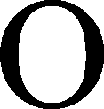
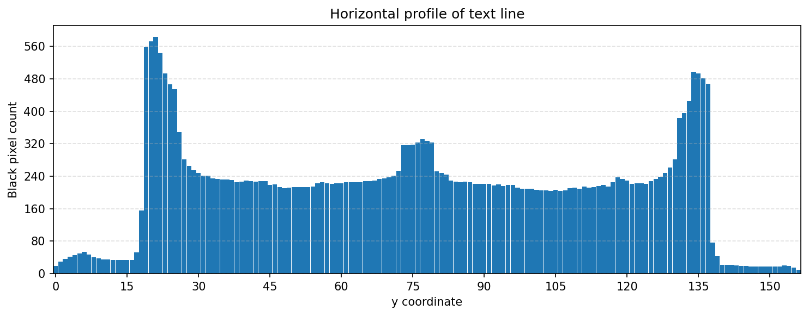
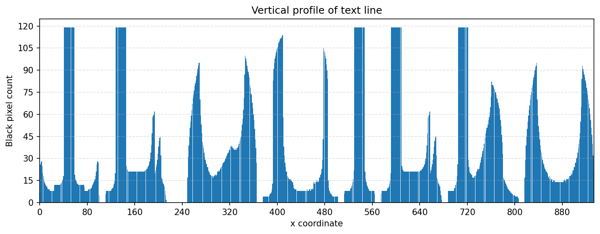
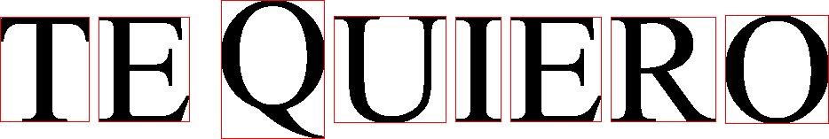
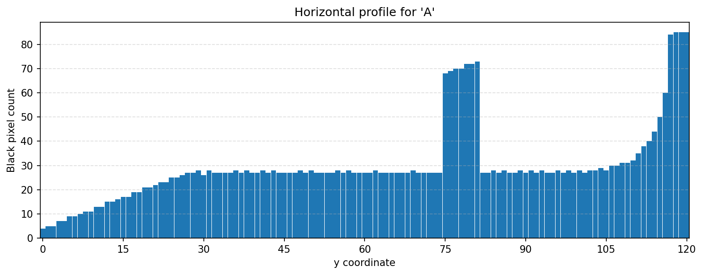
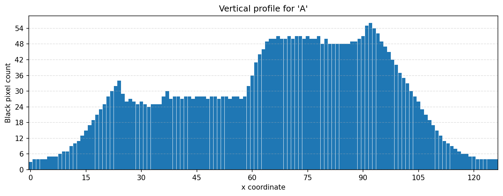
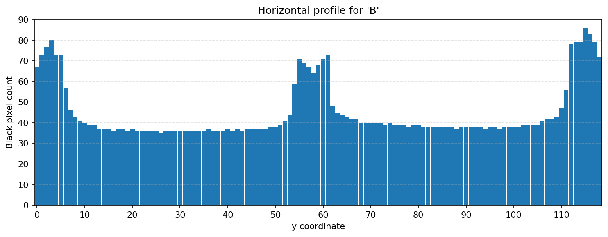
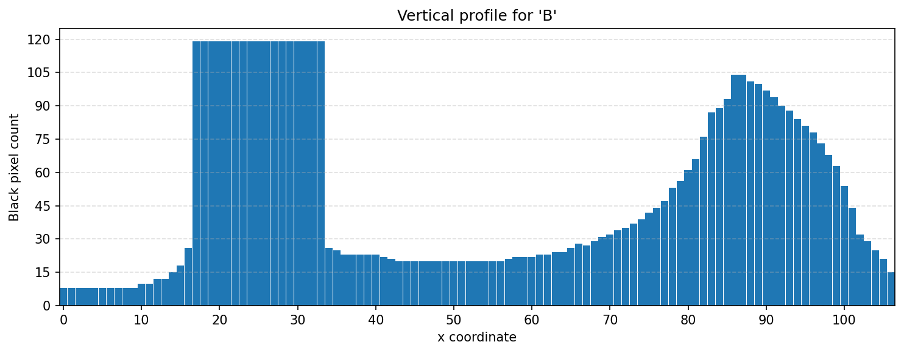
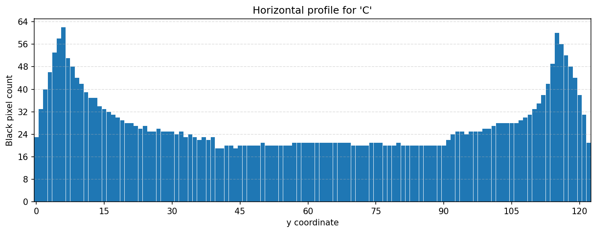
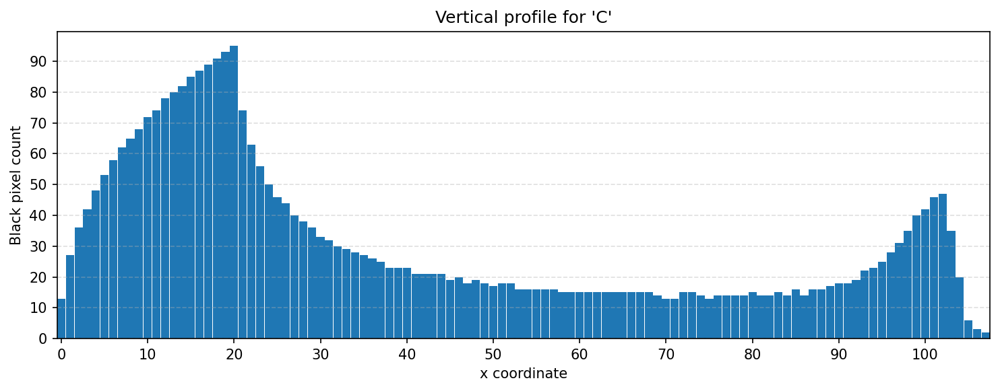

# Лабораторная работа №6. Сегментация текста. Вариант 14

**Испанские заглавные буквы**  
**Алфавит:** `ABCDEFGHIJKLMNÑOPQRSTUVWXYZ`

---

## Теоретическая часть

В данной лабораторной работе рассматривается **сегментация текста** на основе профилей изображения. По условию требуется:

- вычислить горизонтальный и вертикальный профили;
- выполнить сегментацию символов в строке на основе профилей с прореживанием;
- получить координаты обрамляющих прямоугольников символов;
- построить профили символов выбранного алфавита.

**Профиль** — это сумма пикселей вдоль выбранного направления.

Для текста используются:

- **горизонтальный профиль** — сумма чёрных пикселей по строкам;
- **вертикальный профиль** — сумма чёрных пикселей по столбцам.

Для строки текста вертикальный профиль удобен тем, что в промежутках между буквами его значения падают до нуля или почти до нуля. По этим провалам можно разделять строку на отдельные символы.

---

## Практическая часть

В работе реализована автоматизированная версия лабораторной:

1. Генерируются символы выбранного алфавита тем же способом, что и в лабораторной №5.
2. Из этих символов автоматически собирается строка `TE QUIERO`.
3. Для строки строятся горизонтальный и вертикальный профили.
4. По вертикальному профилю выполняется сегментация строки на символы.
5. Сохраняются рамки символов, вырезанные буквы и профили алфавита.

---

## Что реализуется в файлах

[`config.py`](config.py) — настройки проекта: алфавит, фраза, параметры шрифта и пути сохранения.  
[`font_utils.py`](font_utils.py) — поиск и загрузка системного `.ttf`-шрифта.  
[`image_utils.py`](image_utils.py) — работа с изображениями, генерация и сохранение.  
[`profiles.py`](profiles.py) — вычисление горизонтальных и вертикальных профилей.  
[`segmentation.py`](segmentation.py) — сегментация строки и построение рамок символов.  
[`main.py`](main.py) — основной файл запуска лабораторной.

---

## Структура результатов

Все результаты сохраняются в папку:

[`output/`](output/)

Основные подпапки:

- [`output/generated/`](output/generated/) — сгенерированная строка и символы;
- [`output/generated/symbols/`](output/generated/symbols/) — изображения символов алфавита;
- [`output/profiles/`](output/profiles/) — профили всей строки;
- [`output/boxes/`](output/boxes/) — строка с обрамляющими прямоугольниками;
- [`output/crops/`](output/crops/) — вырезанные символы строки;
- [`output/alphabet_profiles/`](output/alphabet_profiles/) — профили всех символов алфавита.

---

## Описание обработки

### Часть 1. Генерация символов и строки

#### Исходные данные

Используется алфавит:

`ABCDEFGHIJKLMNÑOPQRSTUVWXYZ`

Используется фраза:

`TE QUIERO`

#### Что формировалось

Автоматически создавались:

- отдельные изображения символов;
- итоговая строка `TE QUIERO`.

#### Куда сохранялись результаты

Символы алфавита сохранялись в папку:

[`output/generated/symbols/`](output/generated/symbols/)

Итоговая строка сохранялась в файлы:

- [`output/generated/generated_text_line.png`](output/generated/generated_text_line.png)
- [`output/generated/generated_text_line.bmp`](output/generated/generated_text_line.bmp)

#### Результат генерации строки

#### Вывод по части 1

Была получена чистая строка текста, пригодная для дальнейшего анализа и сегментации.

---

## Эталонные символы алфавита

| № | Символ | Файл | Изображение |
|---:|:---:|---|---|
| 1 | A | [`A.png`](output/generated/symbols/A.png) |  |
| 2 | B | [`B.png`](output/generated/symbols/B.png) |  |
| 3 | C | [`C.png`](output/generated/symbols/C.png) |  |
| 4 | D | [`D.png`](output/generated/symbols/D.png) |  |
| 5 | E | [`E.png`](output/generated/symbols/E.png) |  |
| 6 | F | [`F.png`](output/generated/symbols/F.png) |  |
| 7 | G | [`G.png`](output/generated/symbols/G.png) |  |
| 8 | H | [`H.png`](output/generated/symbols/H.png) |  |
| 9 | I | [`I.png`](output/generated/symbols/I.png) |  |
| 10 | J | [`J.png`](output/generated/symbols/J.png) |  |
| 11 | K | [`K.png`](output/generated/symbols/K.png) |  |
| 12 | L | [`L.png`](output/generated/symbols/L.png) |  |
| 13 | M | [`M.png`](output/generated/symbols/M.png) |  |
| 14 | N | [`N.png`](output/generated/symbols/N.png) |  |
| 15 | Ñ | [`Ñ.png`](output/generated/symbols/Ñ.png) |  |
| 16 | O | [`O.png`](output/generated/symbols/O.png) |  |
| 17 | P | [`P.png`](output/generated/symbols/P.png) |  |
| 18 | Q | [`Q.png`](output/generated/symbols/Q.png) |  |
| 19 | R | [`R.png`](output/generated/symbols/R.png) |  |
| 20 | S | [`S.png`](output/generated/symbols/S.png) |  |
| 21 | T | [`T.png`](output/generated/symbols/T.png) |  |
| 22 | U | [`U.png`](output/generated/symbols/U.png) |  |
| 23 | V | [`V.png`](output/generated/symbols/V.png) |  |
| 24 | W | [`W.png`](output/generated/symbols/W.png) |  |
| 25 | X | [`X.png`](output/generated/symbols/X.png) |  |
| 26 | Y | [`Y.png`](output/generated/symbols/Y.png) |  |
| 27 | Z | [`Z.png`](output/generated/symbols/Z.png) |  |

---

### Часть 2. Построение профилей строки

#### Что формировалось

Для строки вычислялись:

- горизонтальный профиль;
- вертикальный профиль.

#### Куда сохранялись результаты

Профили строки сохранялись в папку:

[`output/profiles/`](output/profiles/)

Файлы:

- [`output/profiles/text_line_horizontal_profile.png`](output/profiles/text_line_horizontal_profile.png)
- [`output/profiles/text_line_vertical_profile.png`](output/profiles/text_line_vertical_profile.png)

#### Результаты

Горизонтальный профиль строки:

Вертикальный профиль строки:

#### Вывод по части 2

Горизонтальный профиль показывает положение строки по высоте, а вертикальный хорошо отражает промежутки между буквами.

---

### Часть 3. Сегментация строки на символы

#### Что формировалось

Для строки выполнялась сегментация на отдельные символы с построением обрамляющих прямоугольников в порядке чтения слева направо.

#### Как выполнялась обработка

- по горизонтальному профилю находились границы строки;
- внутри строки строился вертикальный профиль;
- профиль прореживался;
- непрерывные участки ненулевого профиля считались отдельными символами;
- для каждого символа строился прямоугольник.

#### Куда сохранялись результаты

Строка с рамками сохранялась в папку:

[`output/boxes/`](output/boxes/)

Файл:

- [`output/boxes/text_line_boxes.png`](output/boxes/text_line_boxes.png)

Вырезанные символы сохранялись в папку:

[`output/crops/`](output/crops/)

Файлы:

- [`01.png`](output/crops/01.png)
- [`02.png`](output/crops/02.png)
- [`03.png`](output/crops/03.png)
- [`04.png`](output/crops/04.png)
- [`05.png`](output/crops/05.png)
- [`06.png`](output/crops/06.png)
- [`07.png`](output/crops/07.png)
- [`08.png`](output/crops/08.png)

#### Строка с обрамляющими прямоугольниками

#### Вырезанные символы

| № | Файл | Изображение |
|---:|---|---|
| 1 | [`01.png`](output/crops/01.png) |  |
| 2 | [`02.png`](output/crops/02.png) |  |
| 3 | [`03.png`](output/crops/03.png) |  |
| 4 | [`04.png`](output/crops/04.png) |  |
| 5 | [`05.png`](output/crops/05.png) |  |
| 6 | [`06.png`](output/crops/06.png) |  |
| 7 | [`07.png`](output/crops/07.png) |  |
| 8 | [`08.png`](output/crops/08.png) |  |

#### Вывод по части 3

Сегментация отработала корректно: каждая буква была выделена отдельно, без слияния соседних символов.

---

### Часть 4. Профили символов алфавита

#### Что формировалось

Для всех символов алфавита строились:

- горизонтальные профили;
- вертикальные профили.

#### Куда сохранялись результаты

Профили символов сохранялись в папку:

[`output/alphabet_profiles/`](output/alphabet_profiles/)

#### Таблица профилей алфавита

| № | Символ | Горизонтальный профиль | Вертикальный профиль |
|---:|:---:|---|---|
| 1 | A | [`A_horizontal_profile.png`](output/alphabet_profiles/A_horizontal_profile.png) | [`A_vertical_profile.png`](output/alphabet_profiles/A_vertical_profile.png) |
| 2 | B | [`B_horizontal_profile.png`](output/alphabet_profiles/B_horizontal_profile.png) | [`B_vertical_profile.png`](output/alphabet_profiles/B_vertical_profile.png) |
| 3 | C | [`C_horizontal_profile.png`](output/alphabet_profiles/C_horizontal_profile.png) | [`C_vertical_profile.png`](output/alphabet_profiles/C_vertical_profile.png) |
| 4 | D | [`D_horizontal_profile.png`](output/alphabet_profiles/D_horizontal_profile.png) | [`D_vertical_profile.png`](output/alphabet_profiles/D_vertical_profile.png) |
| 5 | E | [`E_horizontal_profile.png`](output/alphabet_profiles/E_horizontal_profile.png) | [`E_vertical_profile.png`](output/alphabet_profiles/E_vertical_profile.png) |
| 6 | F | [`F_horizontal_profile.png`](output/alphabet_profiles/F_horizontal_profile.png) | [`F_vertical_profile.png`](output/alphabet_profiles/F_vertical_profile.png) |
| 7 | G | [`G_horizontal_profile.png`](output/alphabet_profiles/G_horizontal_profile.png) | [`G_vertical_profile.png`](output/alphabet_profiles/G_vertical_profile.png) |
| 8 | H | [`H_horizontal_profile.png`](output/alphabet_profiles/H_horizontal_profile.png) | [`H_vertical_profile.png`](output/alphabet_profiles/H_vertical_profile.png) |
| 9 | I | [`I_horizontal_profile.png`](output/alphabet_profiles/I_horizontal_profile.png) | [`I_vertical_profile.png`](output/alphabet_profiles/I_vertical_profile.png) |
| 10 | J | [`J_horizontal_profile.png`](output/alphabet_profiles/J_horizontal_profile.png) | [`J_vertical_profile.png`](output/alphabet_profiles/J_vertical_profile.png) |
| 11 | K | [`K_horizontal_profile.png`](output/alphabet_profiles/K_horizontal_profile.png) | [`K_vertical_profile.png`](output/alphabet_profiles/K_vertical_profile.png) |
| 12 | L | [`L_horizontal_profile.png`](output/alphabet_profiles/L_horizontal_profile.png) | [`L_vertical_profile.png`](output/alphabet_profiles/L_vertical_profile.png) |
| 13 | M | [`M_horizontal_profile.png`](output/alphabet_profiles/M_horizontal_profile.png) | [`M_vertical_profile.png`](output/alphabet_profiles/M_vertical_profile.png) |
| 14 | N | [`N_horizontal_profile.png`](output/alphabet_profiles/N_horizontal_profile.png) | [`N_vertical_profile.png`](output/alphabet_profiles/N_vertical_profile.png) |
| 15 | Ñ | [`Ñ_horizontal_profile.png`](output/alphabet_profiles/Ñ_horizontal_profile.png) | [`Ñ_vertical_profile.png`](output/alphabet_profiles/Ñ_vertical_profile.png) |
| 16 | O | [`O_horizontal_profile.png`](output/alphabet_profiles/O_horizontal_profile.png) | [`O_vertical_profile.png`](output/alphabet_profiles/O_vertical_profile.png) |
| 17 | P | [`P_horizontal_profile.png`](output/alphabet_profiles/P_horizontal_profile.png) | [`P_vertical_profile.png`](output/alphabet_profiles/P_vertical_profile.png) |
| 18 | Q | [`Q_horizontal_profile.png`](output/alphabet_profiles/Q_horizontal_profile.png) | [`Q_vertical_profile.png`](output/alphabet_profiles/Q_vertical_profile.png) |
| 19 | R | [`R_horizontal_profile.png`](output/alphabet_profiles/R_horizontal_profile.png) | [`R_vertical_profile.png`](output/alphabet_profiles/R_vertical_profile.png) |
| 20 | S | [`S_horizontal_profile.png`](output/alphabet_profiles/S_horizontal_profile.png) | [`S_vertical_profile.png`](output/alphabet_profiles/S_vertical_profile.png) |
| 21 | T | [`T_horizontal_profile.png`](output/alphabet_profiles/T_horizontal_profile.png) | [`T_vertical_profile.png`](output/alphabet_profiles/T_vertical_profile.png) |
| 22 | U | [`U_horizontal_profile.png`](output/alphabet_profiles/U_horizontal_profile.png) | [`U_vertical_profile.png`](output/alphabet_profiles/U_vertical_profile.png) |
| 23 | V | [`V_horizontal_profile.png`](output/alphabet_profiles/V_horizontal_profile.png) | [`V_vertical_profile.png`](output/alphabet_profiles/V_vertical_profile.png) |
| 24 | W | [`W_horizontal_profile.png`](output/alphabet_profiles/W_horizontal_profile.png) | [`W_vertical_profile.png`](output/alphabet_profiles/W_vertical_profile.png) |
| 25 | X | [`X_horizontal_profile.png`](output/alphabet_profiles/X_horizontal_profile.png) | [`X_vertical_profile.png`](output/alphabet_profiles/X_vertical_profile.png) |
| 26 | Y | [`Y_horizontal_profile.png`](output/alphabet_profiles/Y_horizontal_profile.png) | [`Y_vertical_profile.png`](output/alphabet_profiles/Y_vertical_profile.png) |
| 27 | Z | [`Z_horizontal_profile.png`](output/alphabet_profiles/Z_horizontal_profile.png) | [`Z_vertical_profile.png`](output/alphabet_profiles/Z_vertical_profile.png) |

#### Примеры профилей первых трёх символов

| Символ | Горизонтальный профиль | Вертикальный профиль |
|:---:|---|---|
| A |  |  |
| B |  |  |
| C |  |  |

#### Вывод по части 4

Профили алфавита формируют набор эталонных признаков символов для дальнейшего анализа.

---

## Автоматизация сохранения результатов

Программа автоматически сохраняет:

- сгенерированные символы;
- строку `TE QUIERO`;
- профили строки;
- строку с рамками;
- вырезанные символы;
- профили символов алфавита.

Все результаты раскладываются по соответствующим папкам в [`output/`](output/), что упрощает проверку и оформление отчёта.

---

## Общий вывод по лабораторной работе

В лабораторной работе была реализована сегментация текстовой строки на основе профилей изображения.

В качестве входных данных использовалась автоматически собранная строка `TE QUIERO`, сформированная из эталонных символов, полученных тем же способом, что и в лабораторной №5.

Для строки были построены горизонтальный и вертикальный профили, после чего выполнена сегментация на отдельные символы и построены их обрамляющие прямоугольники.

Проверка результатов показала, что профили построены корректно, сегментация выполнена правильно, каждая буква выделена отдельно, а все результаты автоматически сохраняются в удобном виде.
