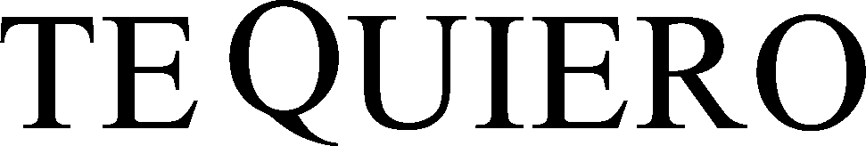
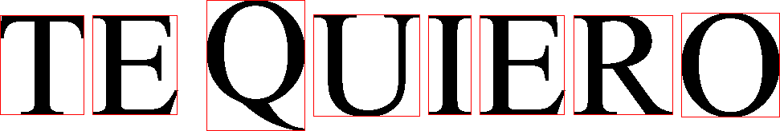
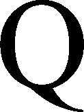
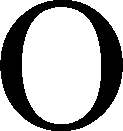

# Лабораторная работа №7. Классификация на основе признаков, анализ профилей. Вариант 14

**Испанские заглавные буквы**
**Алфавит:** `ABCDEFGHIJKLMNÑOPQRSTUVWXYZ`

---

## Теоретическая часть

В работе рассматривается **классификация символов по признакам**. Используются результаты лабораторных №5 и №6: эталонные символы и их признаки, а также сегментация строки.

Распознавание выполняется по евклидову расстоянию в пространстве нормализованных признаков:

* масса;
* координаты центра тяжести;
* осевые моменты инерции.

Каждый символ сравнивается с эталонной базой, после чего формируются гипотезы и выбирается лучшая.

Для оценки результата вычисляются:

* количество ошибок;
* процент верно распознанных символов;
* влияние изменения размера шрифта на точность.

---

## Практическая часть

В работе реализован автоматический конвейер:

* генерация эталонного алфавита;
* вычисление признаков эталонов;
* генерация строки `TE QUIERO`;
* сегментация строки на символы;
* классификация символов;
* сборка итоговой распознанной строки;
* подсчёт ошибок и процента распознавания;
* эксперимент с другим размером шрифта.

---

## Что реализуется в файлах

[`config.py`](config.py) — параметры алфавита, строки, шрифтов и путей.
[`font_utils.py`](font_utils.py) — поиск и загрузка `.ttf`-шрифта.
[`image_utils.py`](image_utils.py) — генерация эталонов, строки и сохранение изображений.
[`features.py`](features.py) — вычисление и сохранение признаков.
[`segmentation.py`](segmentation.py) — профили и сегментация строки.
[`classifier.py`](classifier.py) — мера близости, гипотезы, распознавание и отчёты.
[`main.py`](main.py) — запуск обоих экспериментов и сохранение итогов.

---

## Структура результатов

Все результаты сохраняются в папку:

[`output/`](output/)

Основные подпапки:

* [`output/reference_symbols/`](output/reference_symbols/) — эталонные символы алфавита;
* [`output/reference_features/`](output/reference_features/) — признаки эталонных символов;
* [`output/base_case/`](output/base_case/) — базовый эксперимент;
* [`output/changed_size_case/`](output/changed_size_case/) — эксперимент с другим размером шрифта;
* [`output/reports/`](output/reports/) — итоговая сводка экспериментов.

---

## Эталонные символы алфавита

|  № | Символ | Файл                                      | Изображение                          |
| -: | :----: | ----------------------------------------- | ------------------------------------ |
|  1 |    A   | [`A.png`](output/reference_symbols/A.png) |  |
|  2 |    B   | [`B.png`](output/reference_symbols/B.png) |  |
|  3 |    C   | [`C.png`](output/reference_symbols/C.png) |  |
|  4 |    D   | [`D.png`](output/reference_symbols/D.png) |  |
|  5 |    E   | [`E.png`](output/reference_symbols/E.png) |  |
|  6 |    F   | [`F.png`](output/reference_symbols/F.png) |  |
|  7 |    G   | [`G.png`](output/reference_symbols/G.png) |  |
|  8 |    H   | [`H.png`](output/reference_symbols/H.png) |  |
|  9 |    I   | [`I.png`](output/reference_symbols/I.png) |  |
| 10 |    J   | [`J.png`](output/reference_symbols/J.png) |  |
| 11 |    K   | [`K.png`](output/reference_symbols/K.png) |  |
| 12 |    L   | [`L.png`](output/reference_symbols/L.png) |  |
| 13 |    M   | [`M.png`](output/reference_symbols/M.png) |  |
| 14 |    N   | [`N.png`](output/reference_symbols/N.png) |  |
| 15 |    Ñ   | [`Ñ.png`](output/reference_symbols/Ñ.png) |  |
| 16 |    O   | [`O.png`](output/reference_symbols/O.png) |  |
| 17 |    P   | [`P.png`](output/reference_symbols/P.png) |  |
| 18 |    Q   | [`Q.png`](output/reference_symbols/Q.png) |  |
| 19 |    R   | [`R.png`](output/reference_symbols/R.png) |  |
| 20 |    S   | [`S.png`](output/reference_symbols/S.png) |  |
| 21 |    T   | [`T.png`](output/reference_symbols/T.png) |  |
| 22 |    U   | [`U.png`](output/reference_symbols/U.png) |  |
| 23 |    V   | [`V.png`](output/reference_symbols/V.png) |  |
| 24 |    W   | [`W.png`](output/reference_symbols/W.png) |  |
| 25 |    X   | [`X.png`](output/reference_symbols/X.png) |  |
| 26 |    Y   | [`Y.png`](output/reference_symbols/Y.png) |  |
| 27 |    Z   | [`Z.png`](output/reference_symbols/Z.png) |  |

---

## Описание обработки по частям лабораторной

### Часть 1. Расчёт меры близости символов

Для каждого символа вычислялись нормализованные признаки, после чего между символами находилось евклидово расстояние и мера близости.

Результат сохранялся в файл:

[`output/reference_features/reference_features.csv`](output/reference_features/reference_features.csv)

Папка с признаками:

[`output/reference_features/`](output/reference_features/)

**Вывод:** подготовлена эталонная база и мера близости для классификации.

---

### Часть 2. Сравнение символов строки со всем алфавитом

Строка **TE QUIERO** автоматически генерировалась, сегментировалась на символы, после чего каждый символ сравнивался со всеми эталонами алфавита.

Результаты базового случая сохранялись в папки:

* [`output/base_case/`](output/base_case/)
* [`output/base_case/line/`](output/base_case/line/)
* [`output/base_case/crops/`](output/base_case/crops/)
* [`output/base_case/reports/`](output/base_case/reports/)

Результаты эксперимента с другим размером шрифта сохранялись в папки:

* [`output/changed_size_case/`](output/changed_size_case/)
* [`output/changed_size_case/line/`](output/changed_size_case/line/)
* [`output/changed_size_case/crops/`](output/changed_size_case/crops/)
* [`output/changed_size_case/reports/`](output/changed_size_case/reports/)

**Вывод:** для каждого символа строки был получен набор гипотез.

---

## Базовый случай

### Сгенерированная строка и рамки

Папка:

[`output/base_case/line/`](output/base_case/line/)

Файлы:

* [`generated_text_line.png`](output/base_case/line/generated_text_line.png)
* [`text_line_boxes.png`](output/base_case/line/text_line_boxes.png)

Сгенерированная строка:

Строка с рамками:

### Вырезанные символы

Папка:

[`output/base_case/crops/`](output/base_case/crops/)

|  № | Файл                                      | Изображение                               |
| -: | ----------------------------------------- | ----------------------------------------- |
|  1 | [`01.png`](output/base_case/crops/01.png) |  |
|  2 | [`02.png`](output/base_case/crops/02.png) |  |
|  3 | [`03.png`](output/base_case/crops/03.png) |  |
|  4 | [`04.png`](output/base_case/crops/04.png) |  |
|  5 | [`05.png`](output/base_case/crops/05.png) |  |
|  6 | [`06.png`](output/base_case/crops/06.png) |  |
|  7 | [`07.png`](output/base_case/crops/07.png) |  |
|  8 | [`08.png`](output/base_case/crops/08.png) |  |

### Отчёты базового случая

Папка:

[`output/base_case/reports/`](output/base_case/reports/)

Файлы:

* [`hypotheses.txt`](output/base_case/reports/hypotheses.txt)
* [`recognition_report.txt`](output/base_case/reports/recognition_report.txt)

---

## Эксперимент с другим размером шрифта

### Сгенерированная строка и рамки

Папка:

[`output/changed_size_case/line/`](output/changed_size_case/line/)

Файлы:

* [`generated_text_line.png`](output/changed_size_case/line/generated_text_line.png)
* [`text_line_boxes.png`](output/changed_size_case/line/text_line_boxes.png)

Сгенерированная строка:

Строка с рамками:

### Вырезанные символы

Папка:

[`output/changed_size_case/crops/`](output/changed_size_case/crops/)

|  № | Файл                                              | Изображение                                          |
| -: | ------------------------------------------------- | ---------------------------------------------------- |
|  1 | [`01.png`](output/changed_size_case/crops/01.png) |  |
|  2 | [`02.png`](output/changed_size_case/crops/02.png) |  |
|  3 | [`03.png`](output/changed_size_case/crops/03.png) |  |
|  4 | [`04.png`](output/changed_size_case/crops/04.png) |  |
|  5 | [`05.png`](output/changed_size_case/crops/05.png) |  |
|  6 | [`06.png`](output/changed_size_case/crops/06.png) |  |
|  7 | [`07.png`](output/changed_size_case/crops/07.png) |  |
|  8 | [`08.png`](output/changed_size_case/crops/08.png) |  |

### Отчёты эксперимента

Папка:

[`output/changed_size_case/reports/`](output/changed_size_case/reports/)

Файлы:

* [`hypotheses.txt`](output/changed_size_case/reports/hypotheses.txt)
* [`recognition_report.txt`](output/changed_size_case/reports/recognition_report.txt)

---

## Часть 3. Сохранение гипотез

Для каждого символа гипотезы сортировались по убыванию меры близости и сохранялись в файл.

Результаты сохранялись в:

* [`output/base_case/reports/hypotheses.txt`](output/base_case/reports/hypotheses.txt)
* [`output/changed_size_case/reports/hypotheses.txt`](output/changed_size_case/reports/hypotheses.txt)

**Вывод:** гипотезы сохранены в удобном для анализа виде.

---

## Часть 4. Формирование распознанной строки

Из каждого списка выбиралась лучшая гипотеза, после чего собиралась итоговая строка распознавания и сравнивалась с **TEQUIERO**.

Результаты сохранялись в:

* [`output/base_case/reports/recognition_report.txt`](output/base_case/reports/recognition_report.txt)
* [`output/changed_size_case/reports/recognition_report.txt`](output/changed_size_case/reports/recognition_report.txt)

**Вывод:** по лучшим гипотезам формировалась итоговая строка распознавания.

---

## Часть 5. Подсчёт ошибок и процента распознавания

Распознанная строка сравнивалась с правильной, после чего вычислялись число ошибок и процент правильного распознавания.

Результаты сохранялись в:

* [`output/base_case/reports/recognition_report.txt`](output/base_case/reports/recognition_report.txt)
* [`output/changed_size_case/reports/recognition_report.txt`](output/changed_size_case/reports/recognition_report.txt)

**Вывод:** качество распознавания оценивалось автоматически.

---

## Часть 6. Эксперимент с другим размером шрифта

Дополнительно выполнялся тот же эксперимент с другим размером шрифта, после чего сравнивались результаты двух случаев.

Общая сводка сохранялась в файл:

[`output/reports/experiment_summary.csv`](output/reports/experiment_summary.csv)

Папка со сводкой:

[`output/reports/`](output/reports/)

**Вывод:** изменение размера шрифта влияет на точность распознавания.

---

## Автоматизация сохранения результатов

Программа автоматически сохраняет:

* эталонные символы — [`output/reference_symbols/`](output/reference_symbols/);
* эталонные признаки — [`output/reference_features/reference_features.csv`](output/reference_features/reference_features.csv);
* базовый случай — [`output/base_case/`](output/base_case/);
* эксперимент — [`output/changed_size_case/`](output/changed_size_case/);
* итоговую сводку — [`output/reports/experiment_summary.csv`](output/reports/experiment_summary.csv).

---

## Общий вывод по лабораторной работе

В работе была реализована классификация символов на основе признаков.

В качестве эталонов использовались автоматически сгенерированные символы алфавита, а в качестве распознаваемых объектов — сегментированные буквы строки `TE QUIERO`.

Для каждого символа вычислялись признаки, формировались гипотезы и выбиралась лучшая. После этого собиралась итоговая распознанная строка, подсчитывались ошибки и процент правильного распознавания.

Дополнительный эксперимент с другим размером шрифта показал влияние изменения размера на качество распознавания.
