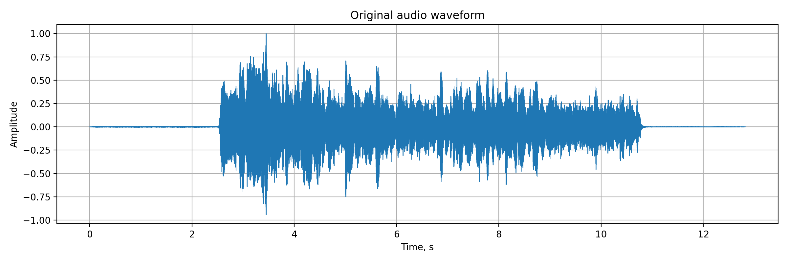
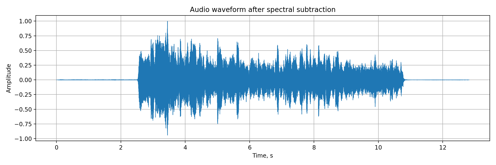
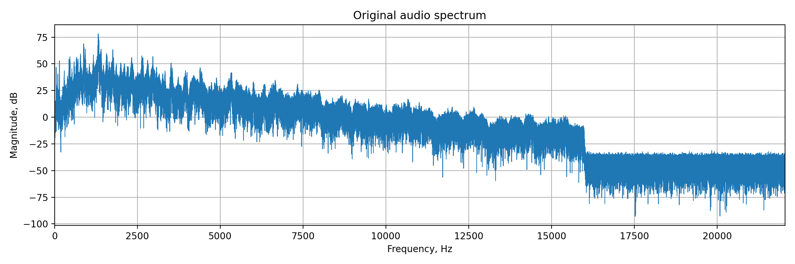
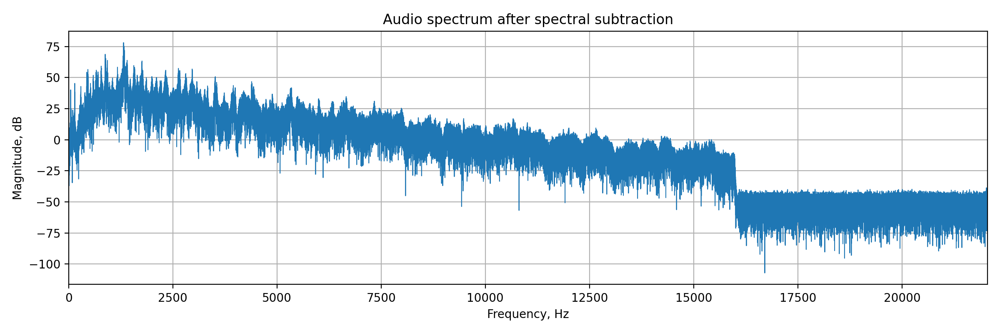
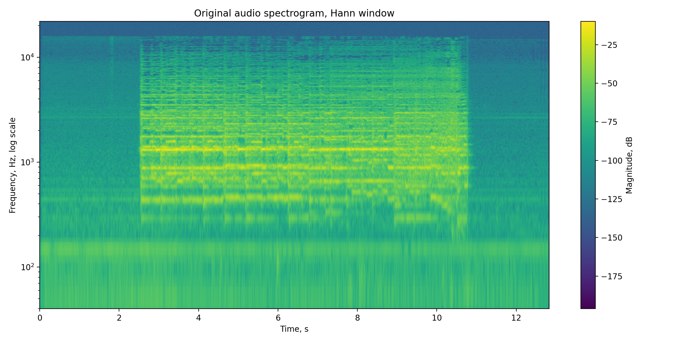
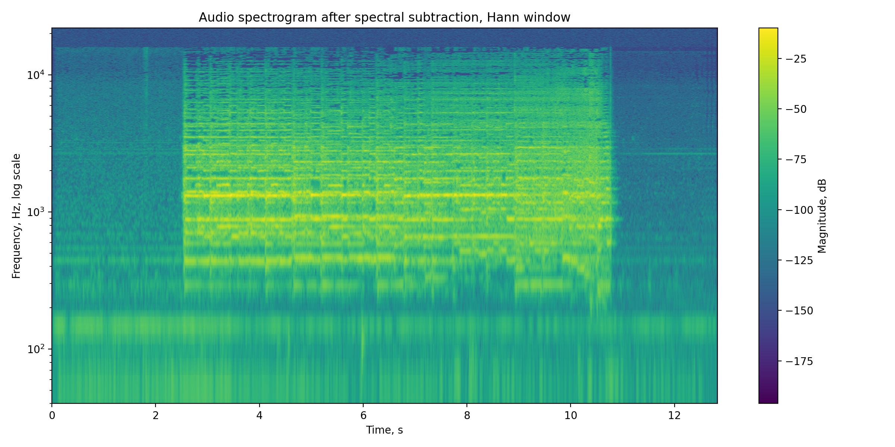

# Лабораторная работа №9. Анализ шума

**Файл:** [`violin_1.wav`](input/violin_1.wav)
**Инструмент:** `скрипка`
**Формат:** `WAV`
**Каналы:** `mono`
**Частота дискретизации:** `44100 Hz`
**Метод шумоподавления:** `спектральное вычитание`
**Окно STFT:** `Hann`

---

## Теоретическая часть

В работе рассматриваются:

* цифровое представление звука;
* построение временной формы сигнала;
* построение спектра;
* построение спектрограммы;
* оценка шума;
* шумоподавление.

Звук в цифровом виде представляет собой последовательность отсчётов.
Частота дискретизации показывает, сколько отсчётов сигнала записывается за одну секунду.

В работе используется аудиозапись скрипки. Запись была сделана через микрофон телефона при воспроизведении звука на ноутбуке, поэтому в сигнале присутствует реальный фоновый шум.

Для анализа частотного состава используется **STFT** — оконное преобразование Фурье.
Сигнал разбивается на короткие окна, и для каждого окна вычисляется спектр. На основе этих данных строится спектрограмма.

Для шумоподавления используется **спектральное вычитание**.
По начальному участку записи оценивается спектр шума, затем он вычитается из спектра всего сигнала. После этого сигнал восстанавливается через обратное STFT.

Фильтр Савицкого–Голея не выбран как основной, потому что он сглаживает сигнал во временной области и может ухудшить тембр музыкального инструмента.

---

## Практическая часть

Реализован автоматический конвейер:

* загрузка WAV-файла;
* проверка количества каналов;
* перевод в mono при необходимости;
* построение waveform;
* построение спектра;
* построение спектрограммы;
* оценка шума по начальному участку записи;
* шумоподавление методом спектрального вычитания;
* сохранение обработанного звука;
* расчёт SNR до и после обработки;
* поиск частотно-временных областей с максимальной энергией.

---

## Что реализуется в файлах

[`src/main.py`](src/main.py) — основной файл лабораторной.

Входные данные:

* [`input/`](input/) — папка с исходным аудиофайлом;
* [`input/violin_1.wav`](input/violin_1.wav) — исходная аудиозапись скрипки.

Выходные данные:

* [`output/`](output/) — папка со всеми результатами;
* [`output/waveform_original.png`](output/waveform_original.png) — waveform исходного сигнала;
* [`output/waveform_spectral_subtraction.png`](output/waveform_spectral_subtraction.png) — waveform после обработки;
* [`output/spectrum_original.png`](output/spectrum_original.png) — спектр исходного сигнала;
* [`output/spectrum_spectral_subtraction.png`](output/spectrum_spectral_subtraction.png) — спектр после обработки;
* [`output/spectrogram_original.png`](output/spectrogram_original.png) — спектрограмма исходного сигнала;
* [`output/spectrogram_spectral_subtraction.png`](output/spectrogram_spectral_subtraction.png) — спектрограмма после обработки;
* [`output/violin_1_spectral_subtraction.wav`](output/violin_1_spectral_subtraction.wav) — обработанный аудиофайл;
* [`output/snr_metrics.csv`](output/snr_metrics.csv) — сравнение SNR до и после обработки;
* [`output/energy_moments_original.csv`](output/energy_moments_original.csv) — максимумы энергии исходного сигнала;
* [`output/energy_moments_spectral_subtraction.csv`](output/energy_moments_spectral_subtraction.csv) — максимумы энергии после обработки.

---

## Структура проекта

| Путь                                       | Назначение                     |
| ------------------------------------------ | ------------------------------ |
| [`input/`](input/)                         | папка с исходным аудиофайлом   |
| [`input/violin_1.wav`](input/violin_1.wav) | исходная запись скрипки        |
| [`output/`](output/)                       | папка с результатами обработки |
| [`src/`](src/)                             | папка с исходным кодом         |
| [`src/main.py`](src/main.py)               | основной Python-скрипт         |
| [`README.md`](README.md)                   | описание лабораторной работы   |

---

## Описание обработки по частям лабораторной

### Часть 1. Загрузка исходного аудио

Исходный файл берётся из папки:

[`input/`](input/)

Файл:

[`input/violin_1.wav`](input/violin_1.wav)

Параметры записи:

* количество каналов: `1`;
* частота дискретизации: `44100 Hz`;
* количество отсчётов: `565362`;
* длительность: около `12.82 с`.

Запись содержит участок фонового шума в начале, основной звук скрипки и затухание в конце.

**Вывод:** файл подходит для лабораторной, так как содержит и полезный сигнал, и отдельный участок шума.

---

### Часть 2. Построение waveform

Строится график амплитуды сигнала во времени.

Результаты:

* [`output/waveform_original.png`](output/waveform_original.png)
* [`output/waveform_spectral_subtraction.png`](output/waveform_spectral_subtraction.png)

#### Waveform исходного сигнала

#### Waveform после спектрального вычитания

**Вывод:** waveform показывает общую структуру записи, но эффект шумоподавления на нём виден слабо, потому что шум намного тише основного сигнала.

---

### Часть 3. Построение спектра

Строится амплитудный спектр исходного и обработанного сигнала.

Результаты:

* [`output/spectrum_original.png`](output/spectrum_original.png)
* [`output/spectrum_spectral_subtraction.png`](output/spectrum_spectral_subtraction.png)

#### Спектр исходного сигнала

#### Спектр после спектрального вычитания

**Вывод:** после обработки общий вид спектра почти не изменился, значит полезные гармоники скрипки в основном сохранились.

---

### Часть 4. Построение спектрограммы

Спектрограмма строится с помощью STFT.

Параметры:

* окно: `Hann`;
* длина окна: `2048 отсчётов`;
* перекрытие: `75%`;
* шкала частот: `логарифмическая`.

Результаты:

* [`output/spectrogram_original.png`](output/spectrogram_original.png)
* [`output/spectrogram_spectral_subtraction.png`](output/spectrogram_spectral_subtraction.png)

#### Спектрограмма исходного сигнала

#### Спектрограмма после спектрального вычитания

**Вывод:** спектрограмма после обработки изменилась слабо. Это нормально, так как алгоритм должен уменьшать шум, но не разрушать структуру музыкального сигнала.

---

### Часть 5. Оценка шума и SNR

Шум оценивается по первым двум секундам записи.

Результат сохраняется в файл:

[`output/snr_metrics.csv`](output/snr_metrics.csv)

Полученные значения:

* SNR до обработки: `34.54 dB`;
* SNR после обработки: `39.45 dB`;
* улучшение: около `4.90 dB`.

**Вывод:** после шумоподавления отношение сигнал/шум увеличилось, значит шумовая составляющая была уменьшена.

---

### Часть 6. Шумоподавление

Используется метод спектрального вычитания.

Параметры:

* `noise_start = 0.0 с`;
* `noise_end = 2.0 с`;
* `reduction_strength = 0.85`;
* `spectral_floor = 0.12`.

Обработанный файл:

[`output/violin_1_spectral_subtraction.wav`](output/violin_1_spectral_subtraction.wav)

**Вывод:** шум стал меньше, но основной звук скрипки почти не изменился. Это хороший результат для мягкого шумоподавления.

---

### Часть 7. Поиск моментов максимальной энергии

По заданию находятся области с максимальной энергией при:

* `Δt = 0.1 с`;
* `Δf = 50 Гц`.

Результаты:

* [`output/energy_moments_original.csv`](output/energy_moments_original.csv)
* [`output/energy_moments_spectral_subtraction.csv`](output/energy_moments_spectral_subtraction.csv)

**Вывод:** основные энергетические области после обработки остались близкими к исходным, значит алгоритм не разрушил структуру звукового сигнала.

---

## Сводная таблица результатов

| Вид результата    | Исходный сигнал                                                     | После шумоподавления                                                                        |
| ----------------- | ------------------------------------------------------------------- | ------------------------------------------------------------------------------------------- |
| Waveform          | [`waveform_original.png`](output/waveform_original.png)             | [`waveform_spectral_subtraction.png`](output/waveform_spectral_subtraction.png)             |
| Спектр            | [`spectrum_original.png`](output/spectrum_original.png)             | [`spectrum_spectral_subtraction.png`](output/spectrum_spectral_subtraction.png)             |
| Спектрограмма     | [`spectrogram_original.png`](output/spectrogram_original.png)       | [`spectrogram_spectral_subtraction.png`](output/spectrogram_spectral_subtraction.png)       |
| Максимумы энергии | [`energy_moments_original.csv`](output/energy_moments_original.csv) | [`energy_moments_spectral_subtraction.csv`](output/energy_moments_spectral_subtraction.csv) |
| Аудиофайл         | [`violin_1.wav`](input/violin_1.wav)                                | [`violin_1_spectral_subtraction.wav`](output/violin_1_spectral_subtraction.wav)             |

---

## Табличные результаты

| Файл                                                                                               | Назначение                                             |
| -------------------------------------------------------------------------------------------------- | ------------------------------------------------------ |
| [`output/snr_metrics.csv`](output/snr_metrics.csv)                                                 | значения SNR до и после шумоподавления                 |
| [`output/energy_moments_original.csv`](output/energy_moments_original.csv)                         | частотно-временные максимумы энергии исходного сигнала |
| [`output/energy_moments_spectral_subtraction.csv`](output/energy_moments_spectral_subtraction.csv) | частотно-временные максимумы энергии после обработки   |

---

## Общий вывод

В работе была выполнена цифровая обработка записи звука скрипки. Исходный файл был загружен в формате `WAV`, `mono`, `44100 Hz`.

Для анализа были построены waveform, спектр и спектрограмма. По начальному участку записи был оценён фоновый шум. Затем было выполнено шумоподавление методом спектрального вычитания.

После обработки SNR увеличился примерно с `34.54 dB` до `39.45 dB`, то есть примерно на `4.90 dB`. При этом основная структура спектра и спектрограммы сохранилась.

Также были найдены частотно-временные области с максимальной энергией при шаге по времени `0.1 с` и ширине частотной полосы `50 Гц`.

Таким образом, в лабораторной были использованы основные идеи лекции по обработке звука: цифровое представление сигнала, STFT, спектрограмма, оценка шума и спектральное шумоподавление.
